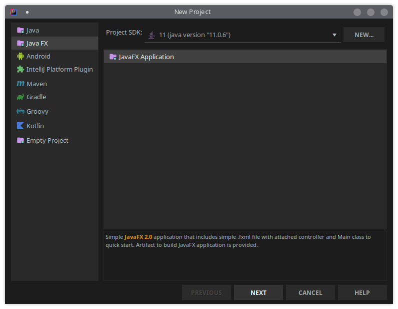
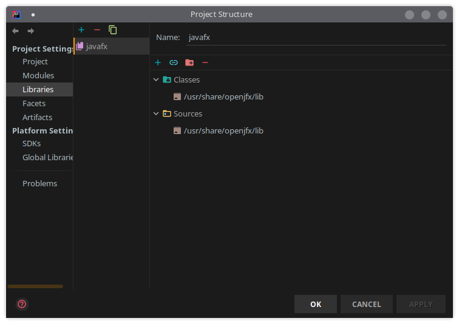
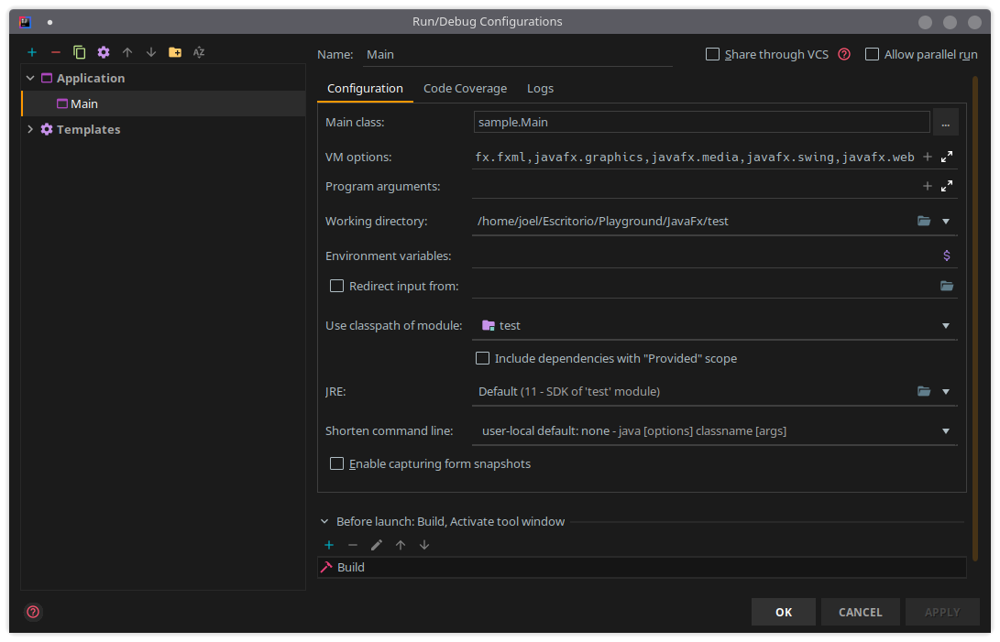
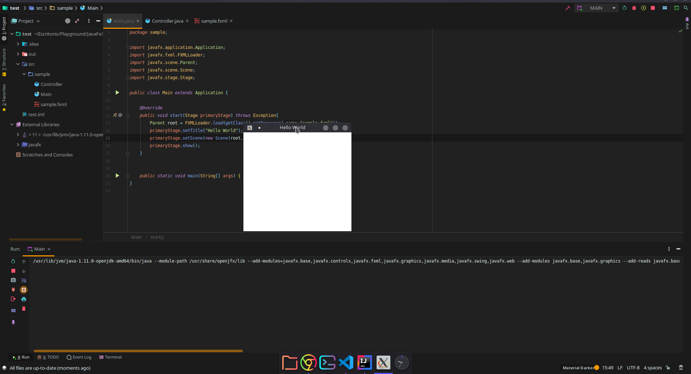

# Instrucciones para desarrollar con JavaFx 11

## Instalando usando `install_javafx_11.sh`
Agregar permisos de ejecución al script
```ssh
chmod +x ./install_javafx_11.sh
```
Y ejecutar
```ssh
/install_javafx_11.sh
```

## Instalación manual
### Instalando OpenJDK 11
Instalar openjdk 11:
```ssh
sudo apt install openjdk-11-jdk 
```
Para verificar la instalación, ejecutamos:
```ssh
java --version
```
```ssh
openjdk 11.0.6 2020-01-14
OpenJDK Runtime Environment (build 11.0.6+10-post-Ubuntu-1ubuntu118.04.1)
OpenJDK 64-Bit Server VM (build 11.0.6+10-post-Ubuntu-1ubuntu118.04.1, mixed mode, sharing)
```
Y checamos también el compilador:
```ssh
javac --version
```
```ssh
javac 11.0.6
```
#### Establecerla como versión default
En caso de que tengas varias versiones de Java instaladas, las enlistamos con:
```ssh
update-java-alternatives --list
```
```ssh
java-1.11.0-openjdk-amd64      1111       /usr/lib/jvm/java-1.11.0-openjdk-amd64
java-13-oracle                 1091       /usr/lib/jvm/java-13-oracle
java-1.8.0-openjdk-amd64       1081       /usr/lib/jvm/java-1.8.0-openjdk-amd64
```
La seleccionamos como default:
```
sudo update-java-alternatives --set /usr/lib/jvm/java-1.11.0-openjdk-amd64
```
### Instalando JavaFx
```ssh
sudo apt install openjfx
```
Verificando la versión:
```ssh
apt show openjfx
```
```ssh
Package: openjfx
Version: 11.0.2+1-1~18.04.2
Priority: optional
Section: universe/java
Origin: Ubuntu
Maintainer: Debian Java Maintainers <pkg-java-maintainers@lists.alioth.debian.org>
Bugs: https://bugs.launchpad.net/ubuntu/+filebug
Installed-Size: 30.7 kB
Depends: libopenjfx-java
Recommends: openjfx-source
Homepage: https://openjfx.io
Download-Size: 9 032 B
APT-Manual-Installed: yes
APT-Sources: http://mx.archive.ubuntu.com/ubuntu bionic-updates/universe amd64 Packages
Description: JavaFX/OpenJFX - Rich client application platform for Java
```

## Proyecto en Intellij:
### Creación del proyecto
Ir a `File > New Project > Java Fx`, asegurarse que el SDK usado es la versión 11.

### Añadiendo las librerías al proyecto
Ir a `File > Project Structure > Libraries > Add > Java` y buscamos la ruta de instalación del SDK de JavaFx (`\lib`), nombrarlo por ejemplo `javafx` y clickear `Apply`.

La ruta se puede encontrar con:
```ssh
dpkg -L openjfx
```
En este punto, en `External Libraries` deberíamos ver `javafx` o como nosotros hayamos nombrado la librería externa.
### Añadiendo `--module-path` a la VM
Ir a `Run > Edit Configurations... > Main > VM options` y agregar:
```ssh
--module-path /usr/share/openjfx/lib --add-modules=javafx.base,javafx.controls,javafx.fxml,javafx.graphics,javafx.media,javafx.swing,javafx.web
```

### Ejecutando
Si todo fue bien, vamos a `Run > Run > Main` y deberíamos de ver el programa JavaFx corriendo.
